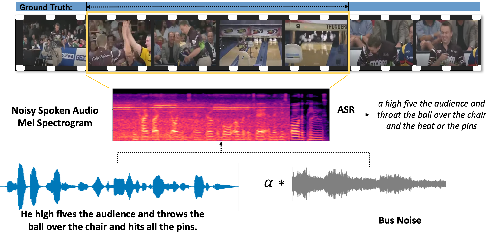

# Spoken-Video-Grounding
This is a Pytorch implementation for MM 2022 paper "Video-Guided Curriculum Learning for Spoken Video Grounding".

## Introduction
We introduce a new task, spoken video grounding (SVG), which aims to localize the desired video fragments from spoken language descriptions. Compared with using text, employing audio requires the model to directly exploit the useful phonemes and syllables related to the video from raw speech. Moreover, we randomly add environmental noises to this speech audio, further increasing the difficulty of this task and better simulating real applications. To rectify the discriminative phonemes and extract video-related information from noisy audio, we develop a novel video-guided curriculum learning (VGCL) during the audio pre-training process, which can make use of the vital visual perceptions to help understand the spoken language and suppress the external noise. Considering during inference the model can not obtain ground truth video segments, we design a curriculum strategy that gradually shifts the input video from the ground truth to the entire video content during pre-training. Finally, the model can learn how to extract critical visual information from the entire video clip to help understand the spoken language. In addition, we collect the first large-scale spoken video grounding dataset based on ActivityNet, which is named as ActivityNet Speech dataset.

